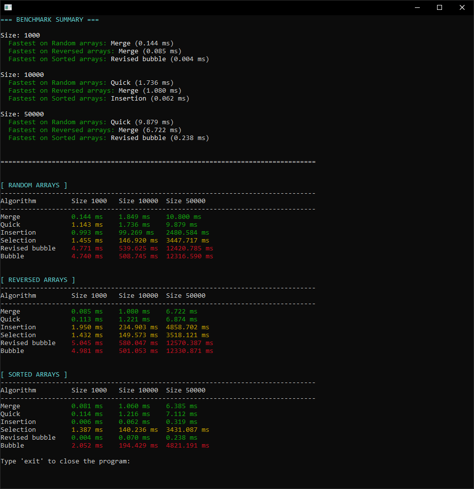

# C++ Sorting Algorithms Benchmark Suite


A comprehensive benchmarking tool for comparing performance of various sorting algorithms. This project provides detailed analysis of 6 sorting algorithms across multiple array sizes and data patterns, featuring colored console output, progress tracking, and comprehensive result tables.



## ✨ Features

### 🎯 Core Functionality
- **6 Sorting Algorithms** tested: Merge Sort, Quick Sort, Insertion Sort, Selection Sort, Revised Bubble Sort, and Bubble Sort
- **Multiple Test Cases** with random, reversed, and pre-sorted arrays
- **Flexible Array Sizes** - benchmark different data volumes (default: 1000, 5000, 10000, 25000, 50000)
- **Result Validation** - automatically verifies that algorithms produce correctly sorted output
- **Performance Metrics** - precise timing measurements in milliseconds

### 🖥️ Advanced Features
- **Color-coded Results** - visual performance indicators (green/yellow/red) for easy comparison
- **Progress Tracking** - real-time progress display during benchmark execution
- **Summary Display** - quick overview of fastest algorithms for each scenario
- **Detailed Tables** - comprehensive performance tables for all algorithms and array types
- **Dynamic Console Buffer** - automatic buffer sizing for scrolling with many array sizes
- **Cross-platform Support** - works on Windows and macOS with platform-specific console handling

### 🔧 Technical Excellence
- **Modern C++17** with clean architecture and namespace organization
- **RAII Principles** for resource management
- **STL Containers** for efficient data handling
- **Modular Design** with separation of concerns
- **Comprehensive Comments** throughout codebase for maintainability

## 🚀 Quick Start

### Prerequisites
- **C++17 compatible compiler** (GCC 7+, Clang 5+, MSVC 2017+)
- **CMake 3.15+** (optional, for build system)
- **Windows 10/11** or **macOS 10.14+** (Linux support can be added)

### Installation & Build

#### Method 1: Direct Compilation

**Windows:**
```bash
git clone https://github.com/yourusername/sorting-benchmark.git
cd sorting-benchmark

# Create build directory (if needed)
mkdir build\windows

# Compile all source files
g++ -std=c++17 -O2 -o build\windows\sorting.exe src\*.cpp src\sorting\*.cpp -I./src

# Run the benchmark
build\windows\sorting.exe
```

**macOS/Linux:**
```bash
git clone https://github.com/yourusername/sorting-benchmark.git
cd sorting-benchmark

# Create build directory
mkdir -p build/macos

# Compile all source files
clang++ -std=c++17 -O2 -o build/macos/sorting src/*.cpp src/sorting/*.cpp -I./src

# Run the benchmark
./build/macos/sorting
```

#### Method 2: CMake Build (if CMakeLists.txt provided)
```bash
git clone https://github.com/yourusername/sorting-benchmark.git
cd sorting-benchmark

# Create build directory
mkdir build && cd build

# Configure and build
cmake .. -DCMAKE_BUILD_TYPE=Release
cmake --build .

# Run the application
./sorting_benchmark.exe
```

#### Method 3: Manual IDE Setup
1. Open your preferred IDE (Visual Studio, CLion, Xcode, etc.)
2. Create new C++ Console Application project
3. Add all files from `src/` directory to project
4. Set C++ standard to C++17
5. Build and run!

### Project Structure
```
sorting-benchmark/
├── src/
│   ├── main.cpp                              # Application entry point
│   ├── benchmark_runner.cpp/h               # Main benchmark orchestration
│   ├── benchmark_data.cpp/h                  # Data structures for results
│   ├── benchmark_algorithm_runner.cpp/h      # Algorithm execution logic
│   ├── benchmark_progress.cpp/h             # Progress display utilities
│   ├── benchmark_summary_display.cpp/h       # Summary output formatting
│   ├── benchmark_tables_display.cpp/h        # Detailed table formatting
│   ├── sort_bench.cpp/h                      # Timing and validation
│   ├── array_utils.cpp/h                     # Test array generation
│   ├── console_output.cpp/h                 # Cross-platform console utilities
│   ├── table_formatter.cpp/h                # Table formatting with colors
│   ├── text_colors.cpp/h                    # ANSI color codes
│   └── sorting/                              # Sorting algorithm implementations
│       ├── base_sorter.hpp                   # Abstract base class
│       ├── bubble_sort.cpp/h                 # Bubble sort
│       ├── revised_bubble_sort.cpp/h         # Optimized bubble sort
│       ├── selection_sort.cpp/h              # Selection sort
│       ├── insertion_sort.cpp/h              # Insertion sort
│       ├── merge_sort.cpp/h                   # Merge sort
│       └── quicksort.cpp/h                   # Quick sort
├── img/
│   └── image.png                             # Screenshot of application
├── build/                                    # Build outputs
└── README.md                                 # This file
```

## 💻 Usage Guide

### Running Benchmarks

Simply run the executable:
```bash
./sorting_benchmark.exe
```

The program will:
1. Initialize console and display welcome message
2. Run benchmarks on all algorithms with specified array sizes
3. Show progress indicator during execution
4. Display summary of fastest algorithms
5. Show detailed performance tables
6. Wait for user input to exit

### Understanding Results

**Summary Section:**
- Shows the fastest algorithm for each array size and type
- Displays execution time in milliseconds

**Detailed Tables:**
- Color coding:
  - 🟢 **Green**: Fastest 20% of algorithms
  - 🟡 **Yellow**: Middle 60% performance
  - 🔴 **Red**: Slowest 20% of algorithms
- `[!]` marker indicates failed validation (incorrect sort)

**Array Types:**
- **RANDOM**: Randomly distributed integers
- **REVERSED**: Descending order (worst case for most algorithms)
- **SORTED**: Ascending order (best case for some algorithms)

### Customizing Benchmarks

Edit `main.cpp` to change array sizes:
```cpp
// Change array sizes (in elements)
std::vector<int> sizes = {1000, 5000, 10000, 25000, 50000};
// The console buffer size is automatically calculated based on the number of sizes
```

**Note:** The console buffer automatically adjusts to accommodate any number of array sizes, allowing you to scroll through the results even with many test cases.

## 🔧 Technical Architecture

### Core Components

```
BenchmarkRunner
├── BenchmarkData           // Result storage
│   ├── Timing results      // Performance metrics
│   └── Validation flags    // Sort correctness
├── BenchmarkAlgorithmRunner // Algorithm execution
│   └── ArrayGenerator       // Test data creation
├── SortBench                // Timing & validation
└── Display Modules
    ├── SummaryDisplay       // Fastest algorithm summary
    └── TablesDisplay        // Detailed tables
```

### Key Design Patterns
- **Strategy Pattern**: Polymorphic sorting algorithms via `BaseSorter`
- **Namespace Organization**: Clean separation of concerns
- **RAII**: Automatic resource management
- **STL Algorithms**: Leveraging standard library efficiency
- **Error Handling**: Validation of sort correctness

### Algorithm Implementations

**O(n log n) Algorithms:**
- **Merge Sort**: Stable, divide-and-conquer, guaranteed O(n log n)
- **Quick Sort**: In-place, randomized pivot selection, O(n log n) average

**O(n²) Algorithms:**
- **Bubble Sort**: Simple but inefficient
- **Revised Bubble Sort**: Optimized with early termination
- **Selection Sort**: Finds minimum and swaps
- **Insertion Sort**: Efficient for small arrays, O(n) best case

## 🛠️ Development

### Code Style
- **C++17** standards compliance
- **snake_case** for variables and functions
- **PascalCase** for class names
- **Namespaces** for logical grouping
- **Comprehensive comments** explaining algorithms and logic
- **4-space indentation**

### Adding New Algorithms

1. Create new files in `src/sorting/`:
   ```cpp
   // my_sort.hpp
   #pragma once
   #include "base_sorter.hpp"
   
   class MySort : public BaseSorter {
   public:
       std::vector<int> sort(std::vector<int>& array) override;
   };
   ```

2. Implement the algorithm in `.cpp` file

3. Add to benchmark runner:
   ```cpp
   // In benchmark_algorithm_runner.cpp
   #include "sorting/my_sort.hpp"
   MySort mySort;
   if (algoName == "My Sort") sorter = &mySort;
   ```

4. Add name to algorithm list:
   ```cpp
   // In benchmark_data.cpp
   data.algorithmNames = {..., "My Sort"};
   ```

### Testing
```bash
# Manual testing
./sorting_benchmark.exe

# Verify results
# - Check that all algorithms complete
# - Verify validation flags (all should be true)
# - Compare times are reasonable
```

## 🌟 Advanced Features

### Performance Analysis
- **High-resolution timing** using `std::chrono::high_resolution_clock`
- **Millisecond precision** for accurate measurements
- **Multiple test patterns** to identify algorithm strengths/weaknesses

### Console Enhancements
- **ANSI color support** on Windows (via Virtual Terminal Processing)
- **Dynamic console sizing** for optimal display
- **Adaptive buffer sizing** - automatically calculates buffer size based on number of test cases for smooth scrolling
- **Progress indicators** during long-running benchmarks
- **Cross-platform compatibility** with conditional compilation

### Result Formatting
- **Color-coded performance** for visual quick analysis
- **Formatted tables** with aligned columns
- **Summary statistics** highlighting best performers
- **Validation indicators** showing correctness

## 📊 Performance Characteristics

Expected performance (typical results on modern hardware):

| Algorithm | Best Case | Average | Worst Case | Space |
|-----------|-----------|---------|------------|-------|
| Merge Sort | O(n log n) | O(n log n) | O(n log n) | O(n) |
| Quick Sort | O(n log n) | O(n log n) | O(n²) | O(log n) |
| Insertion Sort | O(n) | O(n²) | O(n²) | O(1) |
| Selection Sort | O(n²) | O(n²) | O(n²) | O(1) |
| Bubble Sort | O(n²) | O(n²) | O(n²) | O(1) |
| Revised Bubble | O(n) | O(n²) | O(n²) | O(1) |

## 🤝 Contributing

Contributions are welcome! Areas for improvement:

- **Additional Algorithms**: Heap Sort, Radix Sort, Tim Sort, etc.
- **Statistical Analysis**: Mean, median, standard deviation of runs
- **Export Functionality**: Save results to CSV/JSON
- **Graphical Output**: Generate performance charts
- **Parallel Algorithms**: Multi-threaded sorting implementations
- **Memory Profiling**: Track memory usage during sorting
- **Linux Support**: Enhanced cross-platform compatibility

### How to Contribute
1. Fork the repository
2. Create a feature branch
3. Make your changes with proper comments
4. Test thoroughly
5. Submit a pull request

## 🐛 Troubleshooting

### Common Issues

**"Console colors not working"**
- On Windows: Ensure Windows 10 version 1809+ (ANSI support)
- Try running as administrator

**"Benchmark takes too long"**
- Reduce array sizes in `main.cpp`
- Some algorithms are inherently slow (e.g., Bubble Sort)

**"Validation failures"**
- Check algorithm implementation for correctness
- Verify array bounds are handled properly

**"Build errors"**
- Ensure C++17 standard is enabled
- Check all source files are included in compilation

**"ld: open() failed, errno=2" (macOS)**
- The build directory may not exist. Run `mkdir -p build/macos` before compiling
- Or use the VS Code build task which automatically creates the directory
- Ensure you have write permissions in the build directory

**"Cannot scroll console output"**
- The console buffer is automatically sized based on the number of array sizes
- If you add many sizes, the buffer grows automatically to allow scrolling
- On Windows, ensure you're using a terminal that supports scrolling (Windows Terminal recommended)

## 📜 License

This project is open source. Feel free to use it for personal and educational purposes.

## 🙏 Acknowledgments

- **STL Contributors** for excellent standard library implementations
- **C++ Standards Committee** for C++17 features
- **Open Source Community** for inspiration and feedback

---

**⭐ Star this repo if you find it helpful!**

**🐛 Found a bug?** Open an issue on GitHub!

**💡 Have an idea?** I'd love to hear your suggestions!

---

*Built with ❤️ using C++17 and modern best practices*

